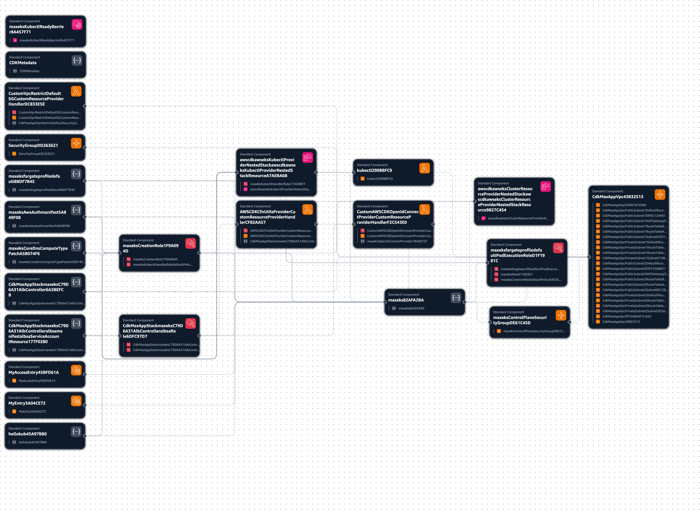

# Welcome to AWS CDK Python project!

This project demonstrates a CDK app with an instance of a stack (`cdk_max_app_stack`)
which contains an Amazon EKS (fargate profile).

## Architecture Diagram



This project is set up like a standard Python project.  The initialization process creates
a virtualenv within this project, stored under the .venv directory.  To create the virtualenv
it assumes that there is a `python3` executable in your path with access to the `venv` package.


After the init process completes and the virtualenv is created, you can use the following
step to activate your virtualenv.

```
$ source .venv/bin/activate
```

Once the virtualenv is activated, you can install the required dependencies.

```
$ pip install -r requirements.txt
```

At this point you can now synthesize the CloudFormation template for this code.

```
$ cdk synth
```

You can now begin exploring the source code, contained in the directory.


To add additional dependencies, for example other CDK libraries, just add to
your requirements.txt file and rerun the `pip install -r requirements.txt`
command.

## Useful commands

 * `cdk ls`          list all stacks in the app
 * `cdk synth`       emits the synthesized CloudFormation template
 * `cdk deploy`      deploy this stack to your default AWS account/region
 * `cdk diff`        compare deployed stack with current state
 * `cdk docs`        open CDK documentation

Enjoy!
